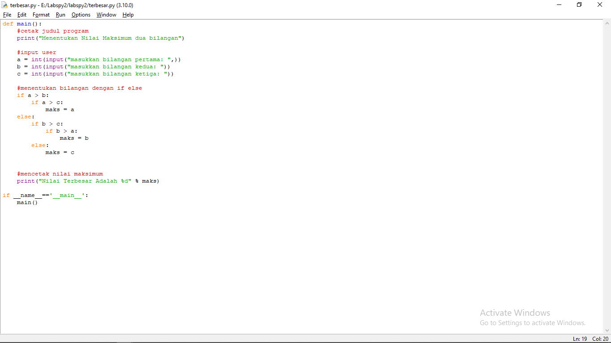
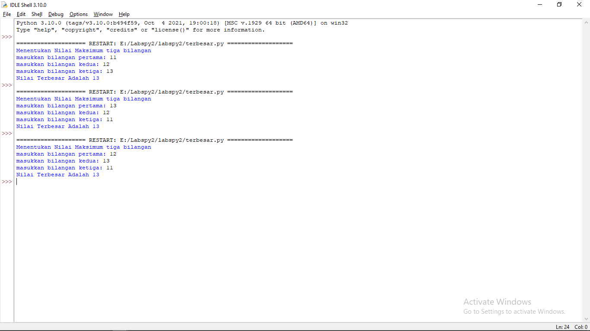

# labspy2
## Latihan

# Berikut adalah codenya

	def main():
    #cetak judul program
    print("Menentukan Nilai Maksimum tiga bilangan")

    #input user
    a = int(input("masukkan bilangan pertama: ",))
    b = int(input("masukkan bilangan kedua: "))
    c = int(input("masukkan bilangan ketiga: "))
    
    #menentukan bilangan dengan if else
    if a > b:
        if a > c:
            maks = a
    else:
        if b > c:
            if b > a:
                maks = b
        else:
            maks = c
        

    #mencetak nilai maksimum
    print("Nilai Terbesar Adalah %d" % maks)

	if __name__=='__main__':
    	main()

# CONTOH INPUTNYA

# TAMPILAN SETELAH DI RUN
